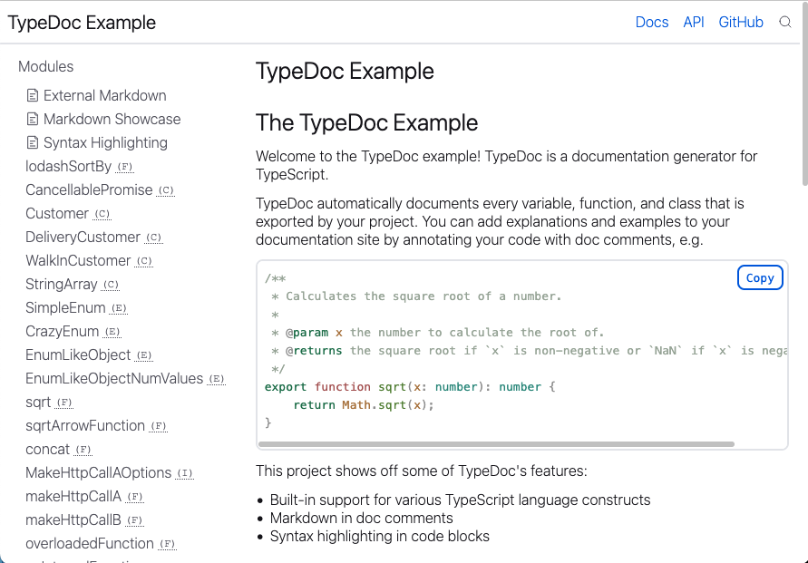
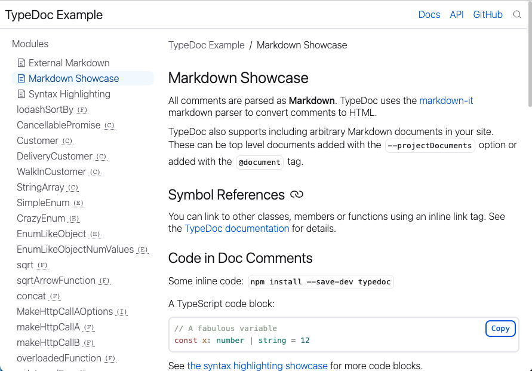
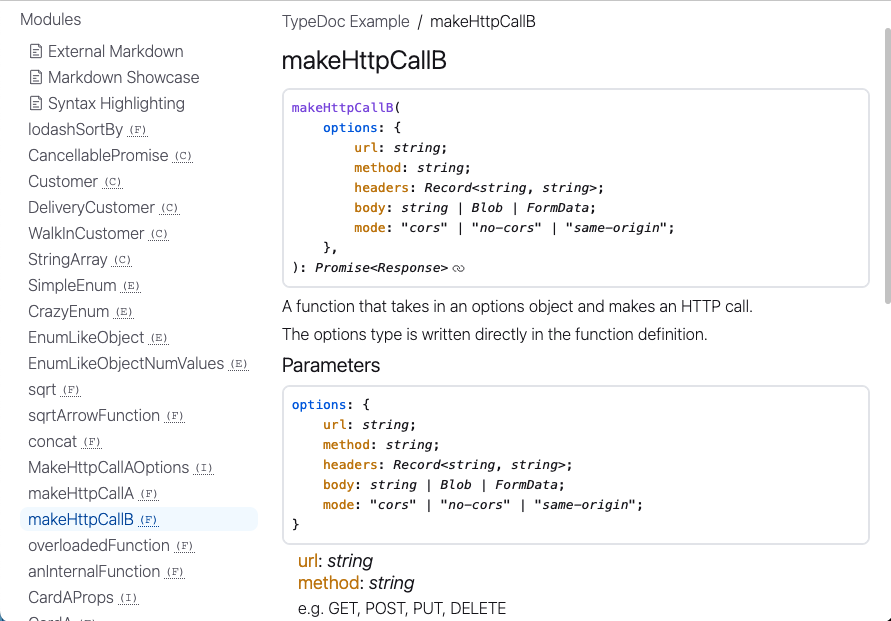
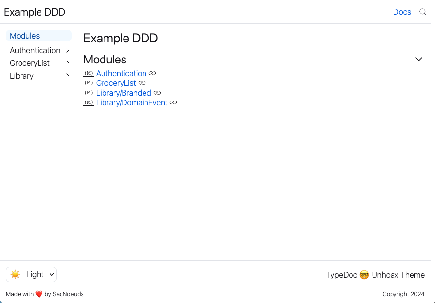
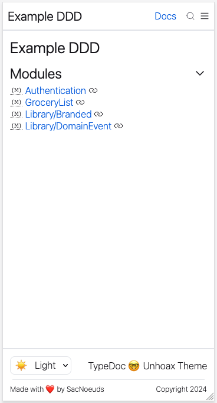
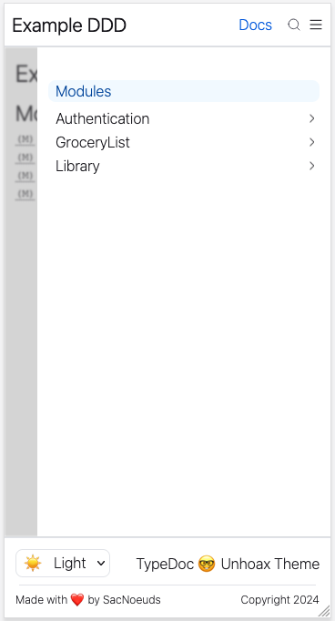

## Installation

```sh
npm i -D typedoc-unhoax-theme
```

…and in your typedoc config:

```json
{
  "plugin": ["typedoc-unhoax-theme"]
}
```

There is no particular configuration for this plugin, it is mainly a theme.

## Examples

### TypeDoc Default Example

You can check the code [in this repo](./examples/typedoc-default/) and the [full website](https://sacdenoeuds.github.io/typedoc-unhoax-theme/typedoc-default/)

<details>
  <summary>Desktop Screenshots</summary>

### Home



### Document



### Function


</details>

### Domain / Use-Case Driven Example

You can check the code [in this repo](./examples/ddd/) and the [full website](https://sacdenoeuds.github.io/typedoc-unhoax-theme/ddd/)

<details>
  <summary>Desktop Screenshots</summary>

### Use Case


### Modules



</details>

<details>
  <summary>Mobile Screenshots</summary>
  <p>
    
    
  </p>
</details>

## Customizing

Here are the CSS variables you can override using `customCss` typedoc config option.

```css
:root {
  --space-xs: 0.125rem;
  --space-s: 0.25rem;
  --space-m: 0.5rem;
  --space-l: 0.75rem;
  --space-xl: 1rem;
  --space-xxl: 1.5rem;

  --radius: 0.5rem;
  --border-thin-size: 1px;
  --border-thick-size: 2px;

  /* palette */
  --green: #1ba673;
  --purple: #8250df;
  --transparent-blue: #e0efff;
  --transparent-blue: #85ceff1a;
  --transparent-grey: #f3f4f6;
  --grey-light: #ededf0;
  --red: #d45656;
  --transparent-black: rgba(212, 86, 86, 0.125);
  --yellow: #c37d0d;
  --yellow-transparent: rgba(195, 125, 13, 0.125);
  --green: #1ba673;
  --green-transparent: rgba(27, 166, 115, 0.125);

  /* --twoslash-tag-bg: rgba(55,114,207,.125); */
  /* --color-ts-function: var(--dark-blue); */
  /* --color-link: var(--dark-blue); */
  /* --color-accent: var(--border-grey); */
  /* --color-ts-interface: var(--green); */

  --color-background-secondary: var(--color-background);
  --color-text-aside: var(--color-text-light);
}

:root[data-theme='light'] {
  --blue-dark: #003eaa;
  --blue-dark: #004ca3;
  --blue: #0060df;
  --blue-light: #3772cf;
  --shadow: 0 0 6px -3px rgba(0, 0, 0, 0.5);
  --border-grey: #e5e7eb;

  --color-background: #fff;
  --color-text: #15141a;
  --color-text-light: #5b5b66;
}

:root[data-theme='dark'] {
  --blue: #1aa3ff;
  --blue-light: #004ca3;
  --blue-dark: #3772cf;
  --shadow: 0 0 6px -3px rgba(255, 255, 255, 0.5);
  --border-grey: #ffffff1a;

  --color-text: #e2e8f0;
  --color-text-light: #a3a3a3;
  --color-background: #111111;
}
```

## Contributing

```sh
npm ci
npm run install-examples # runs `npm ci` in examples folders.
npm run debug # builds the project and the examples

# hosting the example:
npx http-server -p 8900 ./demo
```
