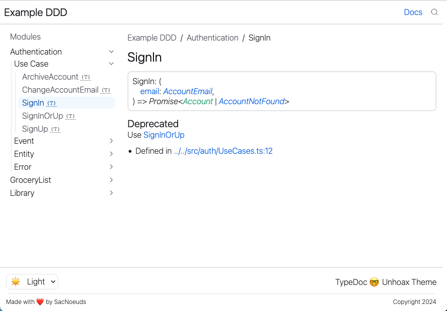

## Installation

```sh
npm i -D typedoc-unhoax-theme
```

…and in your typedoc config:

```json
{
  "plugin": ["typedoc-unhoax-theme"]
}
```

There is no particular configuration for this plugin, it is mainly a theme.

## Examples

### TypeDoc Default Example

You can check the code [in this repo](./examples/typedoc-default/) and the [full website](https://sacdenoeuds.github.io/typedoc-unhoax-theme/typedoc-default/)

<details>
  <summary>Desktop Screenshots</summary>
  
  
  
</details>

### Domain / Use-Case Driven Example

You can check the code [in this repo](./examples/ddd/) and the [full website](https://sacdenoeuds.github.io/typedoc-unhoax-theme/ddd/)

<details>
  <summary>Screenshots</summary>
  
  
</details>

<details>
  <summary>Mobile Screenshots</summary>
  <p align="center">
    
    
  </p>
</details>

## Contributing

```sh
npm ci
npm run install-examples # runs `npm ci` in examples folders.
npm run debug # builds the project and the examples

# hosting the example:
npx http-server -p 8900 ./demo
```
